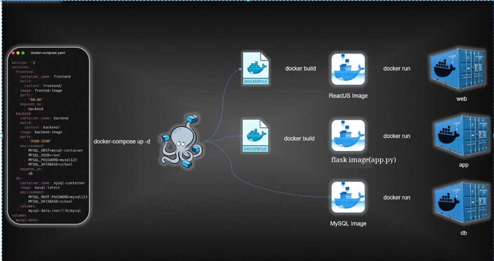

# 3-Tier Python Docker Application

This project demonstrates a 3-tier architecture application using Docker Compose. The system consists of three components:
1. **Frontend**: A web interface built with HTML, CSS, and JavaScript.
2. **Backend**: A Python Flask application that handles business logic and communicates with the database.
3. **Database**: MySQL database for storing user data.

## Table of Contents

- [Architecture](#architecture)
- [Features](#features)
- [Technologies Used](#technologies-used)
- [Setup Instructions](#setup-instructions)
- [Usage](#usage)
- [Screenshots and Architecture Diagram](#screenshots-and-architecture-diagram)
- [Folder Structure](#folder-structure)

---

## Architecture

The 3-tier architecture separates the application into three distinct layers:
- **Frontend**: Serves the user interface and sends requests to the backend.
- **Backend**: Exposes REST APIs and communicates with the database.
- **Database**: Stores and retrieves user data.

Below is a visual representation of the architecture:




---

## Features

- **Frontend**: 
  - Simple UI for adding users.
  - Sends HTTP POST requests to the backend.
  
- **Backend**: 
  - Implements API endpoints using Flask.
  - Handles database communication.
  - CORS enabled for seamless integration with the frontend.

- **Database**:
  - MySQL container with an initialized database and table.
  - Data persistence through Docker volumes.

---

## Technologies Used

- **Docker**: To containerize the application.
- **Docker Compose**: To manage multi-container application.
- **Flask**: Backend framework.
- **Flask-CORS**: For Cross-Origin Resource Sharing.
- **MySQL**: Relational database.
- **HTML/CSS/JavaScript**: Frontend development.

---

## Setup Instructions

1. **Clone the repository:**
   ```bash
   git clone https://github.com/your-username/3-tier-python-docker-app.git
   cd 3-tier-python-docker-app
